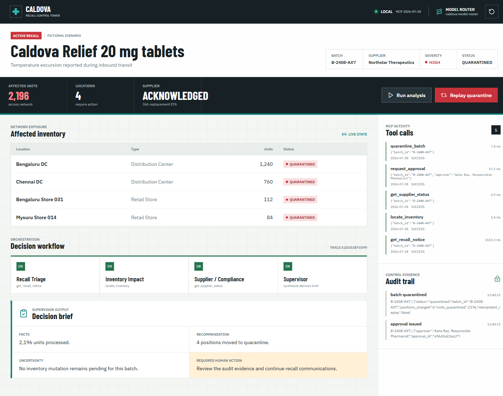
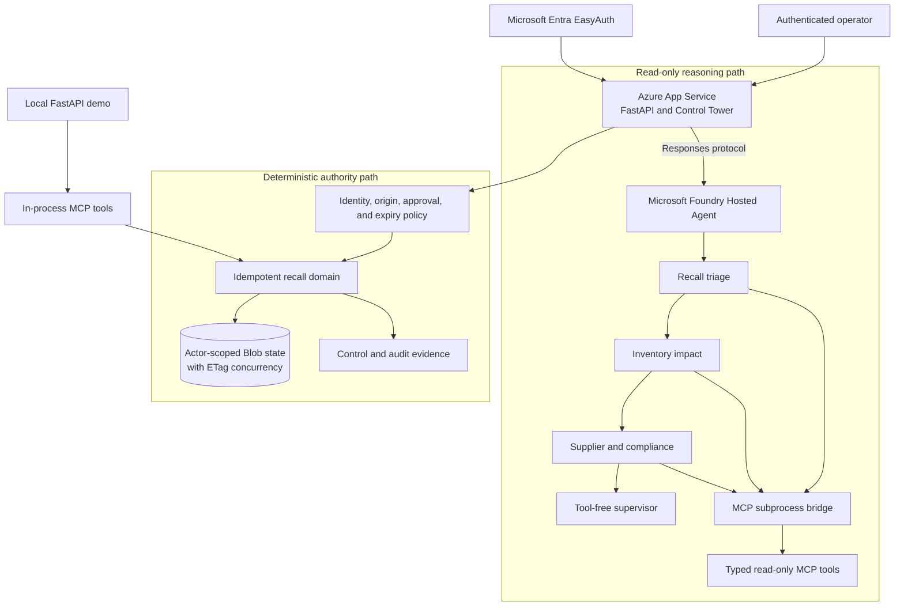

# Caldova Recall Control Tower

A developer demonstration of MCP tool contracts, approval policy, idempotent inventory changes, and a separate Microsoft Agent Framework workflow. Caldova is a fictional pharmaceutical retailer. This is educational software, not a clinical or production recall system.

> Fictional scenario. Synthetic operational data. Recall batch `B-2408-AX7`, 2,196 units across four locations.

## From MCP prototype to reliable agent system

MCP is quickly becoming the standard way for AI agents to interact with tools, APIs, and external systems. Connecting a model to a tool is the easy part. The harder engineering begins when agents must make decisions, coordinate workflows, recover from failures, and operate reliably in production environments.

Caldova is a demo-driven reference solution for those challenges. It combines Microsoft Agent Framework, Microsoft Foundry, and MCP to show how specialized agents can gather evidence and collaborate while deterministic application code retains authority over consequential actions. The emphasis is on software engineering rather than prompts alone: narrow tool contracts, explicit orchestration, request isolation, bounded failures, authenticated approval, optimistic concurrency, audit evidence, and idempotent mutation.

The sample also provides a practical basis for comparing orchestration choices. It implements a fixed sequential workflow because the recall stages have clear dependencies. The final supervisor synthesizes evidence but does not dynamically route agents. Supervisor routing is useful when work cannot be ordered in advance, but it introduces additional control-flow, observability, and evaluation requirements that this workflow deliberately avoids.

## Final application



*The final local demo state after human approval and idempotent quarantine. All people, organizations, products, and operational data shown by the scenario are fictional or synthetic.*

## Application architecture



The architecture separates **reasoning** from **authority**. The Hosted Agent receives only allow-listed read tools and produces a decision brief. It cannot approve or quarantine inventory. The web application validates identity and approval below the model, then deterministic domain code performs the state change and records evidence. Failures from MCP, the hosted endpoint, or concurrent state updates are bounded and surfaced without silently substituting an unverified result.

## Engineering patterns demonstrated

| Pattern | How Caldova demonstrates it |
| --- | --- |
| Sequential workflow | Triage, inventory impact, supplier/compliance, and supervisor stages run in a fixed dependency order. |
| Multi-agent collaboration | Specialists have narrow responsibilities and tool allowlists; a tool-free supervisor synthesizes their accumulated evidence. |
| Human in the loop | An authenticated, authorized person must approve quarantine; a button or model recommendation alone grants no authority. |
| Effective MCP tools | Typed inputs, structured results, read-only/destructive annotations, schema validation, and policy checks below tool descriptions. |
| Reliability and recovery | Timeouts, bounded concurrency, fail-closed hosted analysis, request-isolated workflows, idempotent replay, and Blob ETags. |
| Observability and debugging | MCP inspection, structured errors, response correlation, workflow evidence, audit events, tests, and explicit reporting when hosted traces are unavailable. |
| Security and governance | Least-capability tool exposure, EasyAuth identity, allowlists, origin checks, approval binding, managed identity, and synthetic data. |

## Key takeaways

- Understand where MCP fits in a modern agent architecture: it standardizes tool discovery and invocation, but does not replace authorization, workflow control, or domain policy.
- Choose orchestration to match the workload. Prefer explicit sequencing for known dependencies; use supervisor routing only when dynamic delegation justifies its additional complexity.
- Design narrow, typed MCP tools with structured failures and enforce consequential policy below the model-facing contract.
- Make agent execution observable through correlation, tool evidence, audit records, tests, and truthful handling of missing telemetry.
- Treat identity, security, governance, concurrency, and human approval as application responsibilities rather than prompt instructions.
- Test failure and replay paths before calling an agent application production-ready; a successful happy-path demonstration is not sufficient evidence.

## Two execution paths

- **Local Control Tower:** a browser UI and FastAPI service call MCP tools in process. Python builds the analysis summary and enforces approval and quarantine. No model or cloud account is needed.
- **Hosted agent:** four model-backed agents run in a fixed sequence: triage, inventory, supplier/compliance, then a tool-free supervisor summary. Read-only MCP calls use an isolated subprocess bridge. Hosting requires your own configuration and resources.

These paths reuse domain code and synthetic fixtures, but do not share live state. The browser does not call the hosted agent. The supervisor summarizes; it does not dynamically route agents.

## Run locally

Install Git and Python 3.13 with the Windows Python launcher (`py`). You can run each complete PowerShell block below from anywhere inside this Git clone, including either scripts folder. Its first line changes to the repository root before using repository-relative paths. Include that line when copying commands.

The repository root contains both `caldova-recall-control/` and `scripts/`. Use `Get-Location` to check your current folder. Press Ctrl+C first if the input line already contains text. Create the environment only on first setup; reuse an existing Python 3.13 environment.

```powershell
Set-Location (git rev-parse --show-toplevel)
py -3.13 -m venv caldova-recall-control/.venv
./caldova-recall-control/.venv/Scripts/python.exe -m pip install -r caldova-recall-control/requirements-ui.txt
```

Start the server in its own terminal after setup:

```powershell
Set-Location (git rev-parse --show-toplevel)
./caldova-recall-control/.venv/Scripts/python.exe -m uvicorn control_tower_api:app --app-dir caldova-recall-control/src --host 127.0.0.1 --port 8091
```

On macOS/Linux, replace the first line with `cd "$(git rev-parse --show-toplevel)"`, create the environment with `python3.13 -m venv caldova-recall-control/.venv`, and use `./caldova-recall-control/.venv/bin/python` instead of the Windows executable path.

Open [the Control Tower](http://127.0.0.1:8091), run analysis, approve quarantine, then replay it to confirm no additional stock changes. Keep the service on localhost: an entered approver name is not authenticated identity, and all state is in memory.

The Control Tower follows the browser's light/dark system preference until you use the theme button in the top bar. Your choice is saved in this browser and does not affect recall state or other users.

### Inspect MCP over stdio

After installing the local dependencies above, run the [inspection script](caldova-recall-control/scripts/inspect_mcp.py) from the repository root. Use a separate terminal if the Control Tower is running, and check that terminal's working directory too.

```powershell
Set-Location (git rev-parse --show-toplevel)
./caldova-recall-control/.venv/Scripts/python.exe caldova-recall-control/scripts/inspect_mcp.py
```

The script is in the application's scripts folder, not the top-level `scripts/` folder. It shows MCP discovery and schemas, reads 2,196 units across four locations, rejects malformed input and an unapproved mutation, and verifies unchanged inventory. It uses independent synthetic state, makes no model or cloud calls, and does not change the browser's state.

### VS Code

Open the repository root and install the Microsoft Python extension. After creating the environment and installing the local dependencies above, run **Python: Select Interpreter** and choose the Python executable inside `caldova-recall-control/.venv`. Run **Tasks: Run Task > Run Caldova Control Tower**. The task uses the selected interpreter on Windows, macOS, and Linux; stop it with **Tasks: Terminate Task**.

The separate Agent Inspector tasks require the Foundry Toolkit extension and hosted-agent configuration. They are not prerequisites for the local Control Tower.

## Validate

Run from the repository root, in a separate terminal if the server is running:

```powershell
Set-Location (git rev-parse --show-toplevel)
./caldova-recall-control/.venv/Scripts/python.exe -m pip install -r caldova-recall-control/requirements-test.txt
./caldova-recall-control/.venv/Scripts/python.exe -m pytest caldova-recall-control/tests -q
./caldova-recall-control/.venv/Scripts/python.exe scripts/check_repository.py
```

CI runs local tests, deck builds, repository hygiene checks, and dependency audits. These are not a production certification or a live hosted-agent evaluation.

## Repository layout

| Path | Purpose |
| --- | --- |
| [caldova-recall-control/](caldova-recall-control/README.md) | The application, MCP server, Hosted Agent workflow, Control Tower UI, tests, and presentation |
| [Presenter runbook](caldova-recall-control/presentation/RUNBOOK.md) | Event speaker deck, timings, rebuild commands, and demo limitations |
| [infra/](infra/) | Bicep infrastructure for the Foundry project, Model Router, ACR, and observability |
| [scripts/setup_azd_env.py](scripts/setup_azd_env.py) | Idempotent azd environment bootstrap (detects the principal, sets non-secret values) |
| [azure.yaml](azure.yaml) | Canonical azd manifest that owns the infrastructure and the Hosted Agent lifecycle |
| [scripts/check_repository.py](scripts/check_repository.py) | Redacting checks for public file candidates and staged contents |

## Optional hosting

See the [application README](caldova-recall-control/README.md) for the hosted-agent setup. Run deployment commands from the repository root. Review model availability, costs, identity permissions, and configuration before provisioning. Nothing is deployed by cloning this repository or running the local demo.

## Security and sharing notes

Read [SECURITY.md](SECURITY.md) before exposing a service or publishing a fork. Local credentials, deployment state, generated renders, and old generated decks are ignored. Review the exact staged snapshot before publishing; ignore rules do not remove previously tracked content.

The sharing checker detects selected high-signal patterns, not every secret. It does not audit Git history or inspect pixels in screenshots. Enable GitHub secret scanning and push protection where available, and review screenshots and deck notes manually.

## Contributing

Keep changes focused and use only synthetic data. Include a regression test for behavior changes, run the validation commands above, and describe what was tested in the pull request. Cloud deployment is not required for local-only changes; clearly identify any hosted behavior that was not verified.

Edit presentation generators rather than generated decks; see the [presenter runbook](caldova-recall-control/presentation/RUNBOOK.md) for rebuild instructions. Do not force-add ignored environments, credentials, deployment state, or render output. After selecting files to stage, run `python scripts/check_repository.py --staged` using your project interpreter and review the diff. Follow [SECURITY.md](SECURITY.md) for private vulnerability reports instead of opening a public issue.

## License

Repository code is released under the [MIT License](LICENSE). Event artwork and third-party trademarks remain subject to their owners' rights; see [asset attribution](caldova-recall-control/presentation/assets/README.md).
