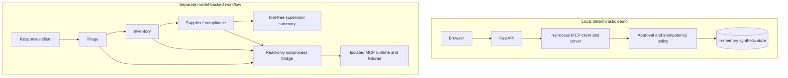

# Caldova Recall Control Tower

A developer demonstration for **Caldova**, a fictional pharmaceutical retailer and distributor. It has two separate execution paths: a deterministic local operator interface and a model-backed, read-only hosted workflow. Neither is a production recall system or a source of clinical advice.

The application supports the 25-minute session **From Prototype to Production: Engineering Agent Systems with MCP, Multi-Agent Patterns and Real Work**. The local browser demo needs no model or cloud account. The separate workflow can be hosted using the Responses protocol.

The hosted agents use the deployment configured by `AZURE_AI_MODEL_DEPLOYMENT_NAME`. The repository includes Model Router configuration, but you must verify model availability, cost, identity permissions, and actual routing behavior in your own environment.

> A clone contains source and configuration, not a live cloud deployment. [SPEC.md](SPEC.md) records design targets and [TODO.md](TODO.md) preserves development history, not fresh verification. Use [presentation/RUNBOOK.md](presentation/RUNBOOK.md) and the final story-led edition for the current presentation.

## Demo story

An inbound temperature excursion triggers a high-risk recall for batch `B-2408-AX7`, **Caldova Relief 20 mg tablets**, supplied by Northstar Therapeutics. The system must:

1. Interpret the recall notice and establish urgency.
2. Locate all affected stock across Caldova's network.
3. Check supplier acknowledgement and replacement status.
4. Produce a concise supervisor decision brief.
5. Require named human approval before quarantine.
6. Quarantine 2,196 units across four locations exactly once.
7. Preserve evidence for compliance and incident review.

The seeded locations are Bengaluru DC, Chennai DC, Mysuru Store 014, and Bengaluru Store 031.

## Two live demos

### Demo 1: deterministic local controls

The local FastAPI service calls MCP tools in process. Python builds its supervisor brief and enforces approval, quarantine, and idempotency. The stage rail represents deterministic processing, not live model-backed agents. The browser does not invoke the hosted workflow.

This demonstrates tool contracts and policy behavior with synthetic data. A typed approver name is not authenticated identity, and local audit records are not durable compliance evidence.

### Demo 2: separate hosted workflow

Four model-backed agents run in a fixed sequence: triage, inventory, supplier/compliance, then a tool-free supervisor summary. The supervisor synthesizes; it does not dynamically route agents. The three specialists only read data through an isolated MCP subprocess bridge.

The two paths reuse domain code and synthetic fixtures, not shared live state. Hosting, identity, traces, and evaluations must be verified independently in your environment. The hosted agents cannot approve or quarantine stock.

### Foundry evaluation evidence

The repository includes [golden cases](tests/golden.jsonl), evaluator configuration, and evaluation scripts. Historical observations in the implementation checklist are not current pass rates or release certification. Run a fresh evaluation against your deployed version and review failures before making quality claims.

## Solution architecture



The MCP boundary uses the Python SDK v2 API. The local API uses an in-process client; the hosted bridge launches an isolated child process. Neither path requires a public MCP endpoint.

The hosted workflow reads `AZURE_AI_MODEL_DEPLOYMENT_NAME`; no agent hardcodes an underlying model. Inspect actual telemetry before claiming which underlying model handled a request. The browser demo makes no model calls.

## Safety model

- Read-only discovery tools are separated from state-changing tools.
- Each specialist receives a least-privilege allowlist of tools.
- Quarantine requires a batch-specific approval issued to a named approver.
- The approval check is enforced below the model in deterministic code.
- Quarantine is idempotent: a retry changes no additional positions.
- Tool calls and policy decisions are written to a structured audit trail.
- OAuth token passthrough is not permitted.
- MCP tool annotations describe behavior but are not treated as authorization controls.

The local API has no caller authentication and must stay on localhost. Its in-memory state is not durable, tamper-evident, or coordinated across replicas. A production implementation must bind approvals to authenticated principals, use transactional storage, expire credentials, rate-limit calls, and enforce network and authorization controls. See [SECURITY.md](../SECURITY.md).

## How it works

The hosted workflow composes four specialized Agent Framework agents around a narrow MCP tool surface. Recall triage can only read notices, inventory impact can only locate stock, supplier/compliance can only read supplier status, and the tool-free supervisor produces the decision summary from full workflow context. Human approval and quarantine are demonstrated separately in the local application. The hosted workflow is served by `ResponsesHostServer`.

The Hosted Agent delegates its three read-only tools through [mcp_v2_bridge.py](src/agent-framework-workflows-responses/mcp_v2_bridge.py), an owned MCP v2 client adapter. The container installs `mcp==2.1.0` in an isolated virtual environment so the Foundry hosting environment does not silently downgrade or conflict with the required protocol stack. Approval and quarantine remain in [caldova_domain.py](src/agent-framework-workflows-responses/caldova_domain.py), below model control.

## Run the local Control Tower

You can run each complete PowerShell block below from anywhere inside this Git clone, including either scripts folder. Its first line changes to the repository root before using repository-relative paths. Include that line when copying commands. Git must be installed.

The repository root is the parent of this application directory and contains both `caldova-recall-control/` and `scripts/`. Use `Get-Location` to check your current folder. Press Ctrl+C first if the input line already contains text.

Install Python 3.13 with the Windows Python launcher (`py`). Create the environment only on first setup; reuse an existing Python 3.13 environment.

```powershell
Set-Location (git rev-parse --show-toplevel)
py -3.13 -m venv caldova-recall-control/.venv
./caldova-recall-control/.venv/Scripts/python.exe -m pip install -r caldova-recall-control/requirements-ui.txt
```

Start the server in its own terminal after setup:

```powershell
Set-Location (git rev-parse --show-toplevel)
./caldova-recall-control/.venv/Scripts/python.exe -m uvicorn control_tower_api:app --app-dir caldova-recall-control/src --host 127.0.0.1 --port 8091
```

On macOS/Linux, replace the first line with `cd "$(git rev-parse --show-toplevel)"`, create the environment with `python3.13 -m venv caldova-recall-control/.venv`, and use `./caldova-recall-control/.venv/bin/python` instead of the Windows executable path.

If Python or the script cannot be found, first check the current directory. For `Could not import module "control_tower_api"`, check that `--app-dir` points to the application's `src` directory and that dependencies were installed in the selected environment.

Open [http://127.0.0.1:8091](http://127.0.0.1:8091). Run analysis, then select **Approve quarantine** and enter a synthetic approver name. Submitting the dialog both approves and quarantines. Use **Replay quarantine** to confirm no additional inventory changes. The **Run Caldova Control Tower** VS Code task starts the same service after dependencies are installed.

### Inspect MCP over stdio

After installing the local dependencies above, run the [inspection script](scripts/inspect_mcp.py) from the repository root. Use a separate terminal if the Control Tower is running, and check that terminal's working directory too.

```powershell
Set-Location (git rev-parse --show-toplevel)
./caldova-recall-control/.venv/Scripts/python.exe caldova-recall-control/scripts/inspect_mcp.py
```

The script is in the application's scripts folder, not the top-level `scripts/` folder. It shows MCP discovery and schemas, reads 2,196 units across four locations, rejects malformed input and an unapproved mutation, and verifies unchanged inventory. It uses independent synthetic state, makes no model or cloud calls, and does not change the browser's state.

### Validate locally

Run all local tests from the repository root, in a separate terminal if the server is running:

```powershell
Set-Location (git rev-parse --show-toplevel)
./caldova-recall-control/.venv/Scripts/python.exe -m pip install -r caldova-recall-control/requirements-test.txt
./caldova-recall-control/.venv/Scripts/python.exe -m pytest caldova-recall-control/tests -q
```

## Option 1: Azure Developer CLI (`azd`)

Run deployment commands from the repository root using its canonical [azure.yaml](../azure.yaml), not the nested manifest. The steps below are optional deployment guidance, not validation performed by the local demo. Check current CLI documentation, model availability, costs, and permissions before provisioning.

### Prerequisites

1. **Azure CLI (`az`)** — [Install Azure CLI](https://learn.microsoft.com/cli/azure/install-azure-cli)
2. **Azure Developer CLI (`azd`)** — [Install azd](https://learn.microsoft.com/azure/developer/azure-developer-cli/install-azd)
3. Install the AI agent extension:
   ```bash
   azd ext install microsoft.foundry
   ```
4. Authenticate both CLIs:
   ```bash
   az login
   azd auth login
   ```

### Create your local deployment environment

The repository does not commit `.azure/` or identity-specific settings. From the repository root, create or update your local azd environment:

```bash
python scripts/setup_azd_env.py --environment caldova-recall-demo
```

The bootstrap defaults to the active Azure CLI subscription, North Central US, and `caldova-model-router`. It detects signed-in users and service principals and records their object ID and principal type for scoped RBAC assignments. For CI or another explicit deployment identity, pass `--principal-id` and `--principal-type` together.

All generated azd values remain under `.azure/` and must not be committed. The agent-level `.env.example` is only for local execution against an already provisioned or existing Foundry project; it is not an Azure deployment secrets file.

Do not rerun `azd ai agent init`; this repository is already initialized and regenerating it could overwrite the application or infrastructure.

### Refresh production dependency locks

The Docker image installs hash-pinned `requirements.lock` and `requirements-mcp.lock` files. Because these locks target the Linux container, regenerate them inside the same `python:3.13-slim` base image so host-specific packages are never pinned. Run this from `caldova-recall-control/src/agent-framework-workflows-responses` whenever either source requirements file changes:

```bash
docker run --rm -v "${PWD}:/work" -w /work python:3.13-slim sh -c '
  pip install "pip==25.3" "pip-tools==7.5.2" &&
  python -m piptools compile --generate-hashes --strip-extras --output-file requirements.lock requirements.txt &&
  python -m piptools compile --generate-hashes --strip-extras --output-file requirements-mcp.lock requirements-mcp.txt'
```

Commit both updated lockfiles with the source requirement change.

### Provision Azure resources (if needed)

After the deployment plan is validated and deployment is explicitly approved, provision the new Foundry project and Model Router:

```bash
azd provision
```

### Run the agent locally

```bash
azd ai agent run
```

The agent host will start on `http://localhost:8088`.

### Invoke the local agent

In a separate terminal, from the project directory:

```bash
azd ai agent invoke --local "Assess recall batch B-2408-AX7, report affected stock and supplier status, and prepare a supervisor decision brief. Do not quarantine stock without explicit approval."
```

### Deploy to Foundry

After provisioning and local container validation succeed, deploy to Microsoft Foundry:

```bash
azd deploy
```

For the full deployment guide, see [Deploy a hosted agent](https://learn.microsoft.com/en-us/azure/foundry/agents/how-to/deploy-hosted-agent).

### Invoke the deployed agent

```bash
azd ai agent invoke "Assess recall batch B-2408-AX7, report affected stock and supplier status, and prepare a supervisor decision brief. Do not quarantine stock without explicit approval."
```

## VS Code and presentations

Use the [Foundry Toolkit](https://marketplace.visualstudio.com/items?itemName=ms-windows-ai-studio.windows-ai-studio) for hosted-agent development. Keep its hosting environment separate from MCP v2 dependencies, as the [Dockerfile](src/agent-framework-workflows-responses/Dockerfile) does. Debugging the hosted workflow is not the same as starting the local Control Tower task.

Use the [detailed demo guide](demo.md), [final story-led deck](presentation/mcp-community-connect-bengaluru-final.pptx), and [presenter runbook](presentation/RUNBOOK.md) for the current presentation. The overall solution architecture is visible slide 4, immediately before `DEMO 01`. Other deck generators remain reference material and may contain older deployment or timing claims.

## Next steps

- [Quickstart: Create a hosted agent](https://learn.microsoft.com/en-us/azure/foundry/agents/quickstarts/quickstart-hosted-agent) — end-to-end walkthrough using `azd`
- [Agent Framework workflows](https://learn.microsoft.com/en-us/agent-framework/workflows/) — learn more about building workflows
- [Workflow as an agent](https://learn.microsoft.com/en-us/agent-framework/workflows/as-agents?pivots=programming-language-python) — serving workflows via the Responses protocol
- [Manage hosted agents](https://learn.microsoft.com/en-us/azure/foundry/agents/how-to/manage-hosted-agent) — monitor and manage deployed agents
