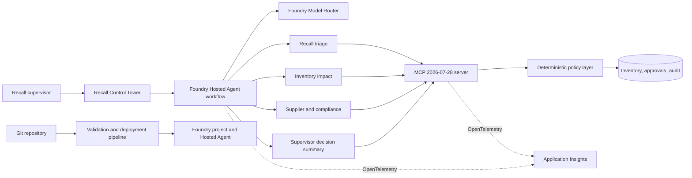

# Caldova Recall Control Tower - Implementation Specification

> Design targets, not a statement that every capability is implemented. The [application README](README.md) describes current behavior: a deterministic local UI and a separate fixed-sequence hosted workflow, with no shared live state. Production identity, durable approvals, cross-replica idempotency, and fresh hosted evidence remain separate validation requirements.

## 1. Purpose

This document records design and acceptance targets for the sample application, Microsoft Foundry deployment, MCP implementation, live demonstrations, and presentation assets for the 25-minute session:

**From Prototype to Production: Engineering Agent Systems with MCP, Multi-Agent Patterns and Real Work**

As AI agents move from experimentation to production, the engineering challenge shifts from raw model capability to orchestration, governance, security, observability, reproducibility, and scale. This solution must demonstrate how Microsoft Foundry Hosted Agents and Model Context Protocol tooling address those concerns with standardized, composable interfaces.

The repository must leave attendees able to explain:

- how MCP connects agents, tools, and external systems;
- how Foundry supplies a managed runtime, identity, security, and observability;
- how specialist agents coordinate without sharing unnecessary privileges;
- how deterministic policy protects consequential business operations;
- how control-plane and data-plane permissions differ;
- how to debug, test, deploy, evaluate, and operate the same design beyond a prototype; and
- how DevOps and GitOps practices make agent systems modular and reproducible.

## 2. Audience and outcomes

The primary audience is AI engineers and application developers moving from experimental agents to scalable, reliable systems.

By the end of the session, attendees should be able to:

1. Identify when to use a multi-agent workflow instead of a single unconstrained agent.
2. Define narrow MCP tools with typed contracts and explicit behavioral annotations.
3. Put approval, authorization, validation, and idempotency below the model layer.
4. Use Microsoft Foundry Hosted Agents with Model Router as a managed production runtime.
5. Apply least privilege across agent tool access, Azure RBAC, and downstream systems.
6. Correlate agent, model, and MCP activity through traces and audit records.
7. Reproduce and promote the solution through source-controlled configuration and automated validation.

## 3. Scenario

Caldova is a fictional pharmaceutical retailer and distributor operating distribution centres and retail stores. A temperature excursion during inbound transit triggers a high-risk recall for:

| Field | Value |
|---|---|
| Batch | `B-2408-AX7` |
| Product | Caldova Relief 20 mg tablets |
| GTIN | `05012345001987` |
| Supplier | Northstar Therapeutics |
| Affected stock | 2,196 units |
| Affected locations | Four |
| Required approver | Named responsible pharmacist or compliance officer |

The system must assess the notice, calculate inventory exposure, obtain supplier status, prepare a supervisor decision brief, request explicit human approval, quarantine the affected stock once, and preserve an audit trail.

The scenario is fictional and uses synthetic data. The UI and presentation must state this clearly and must not imply clinical decision support or use of real patient data.

## 4. Two-demo structure

The session contains two complementary demonstrations. Demo 1 proves the application engineering patterns locally. Demo 2 proves that the same contracts can be deployed, governed, observed, and reproduced on Microsoft Foundry. Neither demo should repeat the other's primary lesson.

### 4.1 Demo 1 - Engineering reliable MCP agent workflows

**Theme:** Connecting a model to a tool is easy; reliable decisions, coordination, recovery, and human control require deliberate software engineering.

**Runtime:** Local project `.venv`, in-process MCP client/server, deterministic Python analysis, synthetic in-memory domain, and local Recall Control Tower UI. The separate hosted Agent Framework workflow uses the subprocess MCP bridge.

**Audience question answered:** How do I turn an MCP-powered prototype into a reliable agent application?

**Required flow:**

1. Reset the synthetic recall state for batch `B-2408-AX7`.
2. Discover the MCP tools and briefly show typed schemas, structured outputs, and behavioral annotations.
3. Run the sequential specialist path: Recall Triage, Inventory Impact, and Supplier/Compliance.
4. Show the Python summary combining tool evidence locally. Explain the separate hosted supervisor's synthesis role; it does not route the next action.
5. Trigger one recoverable failure, such as an unknown batch, invalid tool input, unavailable tool, or partial specialist result.
6. Show the error as sanitized, actionable state rather than an invented answer or uncontrolled retry loop.
7. Attempt quarantine without valid approval and show deterministic rejection.
8. Collect explicit named human approval in the UI.
9. Quarantine 2,196 units across four locations.
10. Replay the same operation and show zero additional mutations.
11. Show the correlated MCP calls, workflow steps, and sanitized audit events.

**Patterns demonstrated:**

- sequential workflow;
- supervisor synthesis in the separate hosted workflow;
- specialist multi-agent collaboration;
- least-privilege tool exposure;
- human-in-the-loop approval;
- deterministic policy below the model;
- idempotent mutation and safe retry;
- tool and workflow observability; and
- practical debugging of protocol, schema, and business errors.

**Key takeaways:**

- MCP is the standardized tool boundary, not the orchestration engine or authorization layer.
- Agent pattern selection should follow workload shape and failure semantics.
- Effective tools are narrow, typed, observable, and honest about side effects.
- Prompts cannot replace identity, approval, validation, or idempotency.
- Production debugging requires correlation across model, workflow, tool, and domain layers.

**Demo 1 acceptance evidence:**

- Local flow completes without Azure connectivity.
- MCP client reports protocol `2026-07-28`.
- The UI exposes tool activity and approval state clearly.
- The failure path recovers without unsafe mutation.
- Invalid approval is rejected and valid quarantine is idempotent.
- Audit output contains no usable approval credential.

### 4.2 Demo 2 - Operating governed agents on Microsoft Foundry

**Theme:** Moving from experimentation to production requires a managed runtime, enterprise identity, observability, reproducible delivery, and clear governance boundaries.

**Runtime:** Microsoft Foundry Hosted Agent workflow using `caldova-model-router`, managed identity, MCP integration, Application Insights, and azd-managed infrastructure.

**Audience question answered:** How do I deploy and operate the same modular agent system securely and repeatably at scale?

**Required flow:**

1. Show `azure.yaml` as the source of truth for the Foundry project, Model Router, and Hosted Agent.
2. Show the immutable Hosted Agent version and deployment status.
3. Invoke the deployed Caldova workflow with batch `B-2408-AX7`.
4. Show that all agents use the `caldova-model-router` deployment while different requests can select different eligible underlying models.
5. Show MCP tool use and multi-agent coordination inside the hosted trace.
6. Identify the runtime managed identity and the narrow data-plane permissions it uses.
7. Contrast those permissions with the deployment identity's control-plane permissions.
8. Show a correlated Application Insights trace containing agent, model, MCP, and outcome data without secrets.
9. Show the source-controlled validation/deployment path and the environment promotion boundary.
10. Explain scale, rollback, evaluation, and failure diagnosis using the deployed evidence.

**Patterns demonstrated:**

- managed Hosted Agent runtime;
- dynamic model selection through Model Router;
- composable MCP integration in a hosted workflow;
- managed identity and least-privilege RBAC;
- control-plane versus data-plane separation;
- distributed tracing and production debugging;
- immutable deployment and rollback metadata;
- CI validation and GitOps promotion; and
- evaluation of quality, latency, routing distribution, and cost.

**Key takeaways:**

- Foundry hosts and operates the agent; MCP keeps tool integration modular and portable.
- Runtime identity must be separate from deployment identity.
- Observability must connect agent decisions to model, tool, and business outcomes.
- Infrastructure, tool contracts, instructions, and evaluations belong in version control.
- Managed hosting does not remove the need for deterministic application controls.

**Demo 2 acceptance evidence:**

- A live Azure query confirms the project, Model Router deployment, and Hosted Agent version.
- The deployed invocation returns the correct inventory impact and does not claim unauthorized mutation.
- Trace evidence identifies `caldova-model-router` and the routed model where available.
- RBAC evidence distinguishes control-plane and data-plane scopes.
- The repository and pipeline show a reproducible validation and promotion path.
- A tested local fallback can replace the cloud portion without breaking the session timing.

## 5. Scope

### 5.1 In scope

- A deterministic recall domain and policy layer.
- An MCP Python SDK v2 server targeting protocol revision `2026-07-28`.
- Specialist-agent orchestration hosted by Microsoft Foundry Agent Service.
- Microsoft Foundry Model Router as the deployed model for every specialist agent.
- A local operational dashboard for the live walkthrough.
- Approval-gated and idempotent inventory quarantine.
- Structured application audit events and distributed traces.
- Azure infrastructure and deployment configuration managed by azd.
- RBAC, identity, control-plane, and data-plane design documentation.
- Local tests, deployment checks, evaluation data, and debugging configuration.
- A timed facilitator runbook and PowerPoint deck.

### 5.2 Out of scope

- Real Caldova, supplier, patient, prescription, or pharmacovigilance data.
- Autonomous clinical or regulatory decisions.
- Production ERP, WMS, POS, or supplier integrations.
- Publicly exposed unauthenticated MCP endpoints.
- A general-purpose chat assistant or marketing landing page.
- Automatic execution of stock mutation without explicit approval.

## 6. Architecture

### 6.1 Runtime boundaries

| Boundary | Responsibility | Must not do |
|---|---|---|
| UI/API | Present state, gather approval, initiate workflows | Invent approval or bypass policy |
| Agent workflow | Coordinate specialist reasoning and summarize results | Hold authoritative inventory state |
| Model Router | Select an eligible underlying model per request | Replace application authorization |
| MCP server | Publish typed tool contracts and protocol behavior | Trust model intent as identity |
| Policy/domain layer | Validate batches, approvals, mutations, replay safety | Depend on prompt compliance |
| Foundry/Azure | Host, identify, authorize, trace, scale, and govern | Make business-policy decisions |

## 7. Microsoft Foundry requirements

### 7.1 Hosted Agent workflow

- The deployable service must use Microsoft Foundry Hosted Agents and the Responses protocol.
- The workflow must use four named specialist roles: Recall Triage, Inventory Impact, Supplier/Compliance, and Supervisor.
- Agent instructions must be role-specific, concise, and testable.
- Each agent must receive only the tools needed for its role.
- Intermediate agent output must remain inspectable in traces while the user receives a concise final brief.
- The workflow must fail safely when model, tool, or downstream calls fail.

### 7.2 Model Router

- The only default model deployment must be `caldova-model-router`.
- The deployment model must be `model-router`, version `2025-11-18`, SKU `GlobalStandard`, capacity `10`.
- The initial routing profile is Balanced.
- Agent code must obtain the deployment name from `AZURE_AI_MODEL_DEPLOYMENT_NAME` and must not hardcode an underlying model.
- Telemetry and evaluation results must identify the underlying routed model where the platform returns it.
- Representative prompts must be evaluated for response quality, latency, routing distribution, and cost before production claims are made.

### 7.3 Azure lifecycle

- `azure.yaml` is the source of truth for the Foundry project, Model Router deployment, and Hosted Agent service.
- The target tenant, subscription, and identity are supplied per environment via `scripts/setup_azd_env.py` and the local azd environment; they must never be committed to source.
- The target region is `northcentralus`.
- Provisioning and deployment must use the project-local azd lifecycle.
- Resource names and environment values must not be copied into source when azd can derive them.
- No resource may be reported as provisioned or deployed until a live Azure query confirms it.

## 8. MCP requirements

### 8.1 Protocol and SDK

- Use the stable Python SDK v2 line with `mcp==2.1.0`.
- Use `MCPServer`, not the deprecated `FastMCP` v1 API.
- Negotiate and test protocol revision `2026-07-28`.
- Use strict typed inputs and generated JSON Schema 2020-12 contracts.
- Return structured content and backward-compatible text content.
- Use per-request protocol metadata; do not rely on protocol sessions or an initialization handshake.
- Do not use deprecated roots, sampling, protocol logging, WebSocket transport, or server-initiated requests.
- Leave built-in OpenTelemetry middleware enabled and propagate W3C trace context.

### 8.2 Tool contract

The server must expose these tools in deterministic order:

| Tool | Purpose | Behavior |
|---|---|---|
| `get_recall_notice` | Return validated recall and product details | read-only, closed-world |
| `locate_inventory` | Return affected positions and totals | read-only, closed-world |
| `get_supplier_status` | Return supplier acknowledgement and replacement state | read-only, closed-world |
| `request_approval` | Record named human approval and issue a scoped credential | write, non-destructive |
| `quarantine_batch` | Quarantine affected positions | write, destructive, idempotent |
| `get_audit_events` | Return sanitized audit history | read-only, closed-world |
| `reset_demo` | Restore synthetic seed state | write, destructive, idempotent, demo-only |

Tool annotations are hints for trusted clients and must never be treated as access controls.

### 8.3 Transport

- The local UI uses an in-process MCP client. The hosted adapter uses custom CLI/JSON IPC with an in-process MCP session inside its isolated child.
- The standalone server and [inspection script](scripts/inspect_mcp.py) exercise MCP stdio. In this mode the server must write only protocol messages to stdout; diagnostics go to stderr.
- A future Streamable HTTP deployment must authenticate every request, validate Origin and Host, use HTTPS, constrain request size, rate-limit calls, and prevent SSRF.
- WebSocket transport is not permitted.

### 8.4 Compatibility constraint

At specification time, published `agent-framework-foundry-hosting` packages require MCP `<2`, while this solution requires MCP `2.1.0`. The implementation must not silently downgrade the server. Integration must use one of these validated paths:

1. a Foundry/Agent Framework release that supports MCP v2;
2. a separate MCP v2 process or service boundary with a compatible client; or
3. a small standards-compliant MCP v2 client adapter owned by the Hosted Agent service.

The selected path must pass the same protocol tests and be documented before deployment.

The selected path combines options 2 and 3. `mcp_v2_bridge.py` is an owned client
adapter that imports the server and opens `Client(mcp)` in process. Its parent passes
a tool name and JSON arguments on the command line and reads JSON output; that outer
exchange is custom IPC, not MCP stdio. The container installs the bridge
and server dependencies in `/opt/caldova-mcp`, isolated from the Hosted Agent
environment and its MCP `<2` dependency. In-memory, real subprocess, and workflow
adapter tests negotiate or consume the required MCP v2 boundary without a downgrade.
Container build and hosted invocation remain deployment gates until validated live.

## 9. Security and governance

### 9.1 Human control

- The UI must show tool exposure and tool invocation state.
- Consequential actions must show their inputs and require explicit confirmation.
- Approval must name the approver and be scoped to the batch.
- A denied, absent, expired, or wrong-batch approval must prevent quarantine.
- Approval credentials must never appear in audit responses, traces, logs, screenshots, or prompts.

### 9.2 Application controls

- Validate all tool inputs before domain execution.
- Sanitize outputs and exception messages before returning them to a model.
- Make mutation idempotent and safe to retry.
- Record correlation ID, actor, operation, batch, outcome, and timestamp.
- Treat state handles as identifiers, not authentication.
- Use cryptographically random, expiring credentials in the production design.
- Do not pass upstream OAuth tokens through MCP to downstream services.

### 9.3 Azure identity and RBAC

The production design must distinguish:

| Plane | Examples | Intended access |
|---|---|---|
| Control plane | Provision Foundry project, deploy model, publish Hosted Agent, assign roles | Deployment identity only |
| Data plane | Invoke model, call connected services, read/write operational data, emit telemetry | Hosted Agent managed identity |

- Runtime code must use managed identity through `DefaultAzureCredential`.
- CI/CD must use workload identity federation rather than stored client secrets.
- Role assignments must use the smallest built-in role and narrowest viable scope.
- The presenter identity must not be used as the production runtime identity.
- RBAC and data-plane checks must be independently testable.

## 10. Multi-agent workflow

### 10.1 Recall Triage

- Reads the recall notice.
- Validates batch identity and risk tier.
- Produces a short incident frame and required next actions.
- Cannot mutate inventory or issue approval.

### 10.2 Inventory Impact

- Reads inventory positions for the validated batch.
- Calculates total units and affected locations from tool output.
- Flags inconsistent or empty results.
- Cannot approve or quarantine stock.

### 10.3 Supplier and Compliance

- Reads supplier acknowledgement and replacement status.
- States what is known, unknown, and operationally relevant.
- Can prepare an approval request but cannot self-approve.
- Cannot quarantine stock.

### 10.4 Supervisor

- Combines specialist evidence into a decision brief.
- Clearly separates facts, recommendation, uncertainty, and required human action.
- Requests approval through the application flow only when the evidence is complete.
- Invokes quarantine only after the application supplies a valid approval credential.

## 11. Demo application

The first screen must be the operational Recall Control Tower, not a landing page.

Required views and states:

- active incident header with product, batch, supplier, severity, and status;
- exposure summary with total units and location count;
- affected-location table with type, quantity, and quarantine state;
- agent workflow timeline with current/completed/error states;
- MCP invocation panel with tool, safe inputs, duration, and outcome;
- sanitized audit timeline;
- approval dialog naming the approver and exact proposed mutation;
- quarantine result, including idempotent replay indication;
- local versus Foundry runtime status;
- reset control for repeatable demonstrations;
- loading, empty, denied, partial failure, and disconnected states.

The UI must work at desktop and mobile viewport sizes, use accessible contrast and focus behavior, avoid nested decorative cards, and prevent text or control overlap.

## 12. Observability and debugging

- Correlate UI/API, agent workflow, model call, MCP request, and domain mutation with one trace or correlation ID.
- Capture MCP method, protocol version, tool name, duration, and error status.
- Capture agent name, workflow step, model deployment, routed model when available, token use, latency, and outcome.
- Export production telemetry to Application Insights without logging secrets or approval credentials.
- Provide VS Code tasks and launch configurations for the agent host, MCP server, UI, tests, and Agent Inspector.
- Document local diagnosis for protocol mismatch, authentication failure, tool error, policy rejection, model routing, and Hosted Agent deployment failure.

## 13. DevOps and GitOps

- Keep application code, prompts/instructions, MCP contracts, infrastructure, evaluation data, and presentation source in version control.
- Pin direct dependencies and document the reason for any preview package.
- Run unit tests, MCP protocol tests, API tests, workflow smoke tests, schema checks, and presentation build checks in CI.
- Validate Bicep/azd configuration before deployment.
- Use pull-request review for tool schema, instruction, RBAC, and infrastructure changes.
- Separate development and production azd environments without duplicating secrets in files.
- Use immutable Hosted Agent versions and retain deployment metadata for rollback.
- Add dependency and secret scanning.
- Require a deployment approval before production promotion.

## 14. Test and evaluation strategy

### 14.1 Deterministic tests

- Unknown batches are handled without mutation.
- Inventory totals equal 2,196 units across four locations.
- Wrong or missing approval is rejected.
- Approval credentials are not exposed by audit tools.
- First quarantine changes four positions; replay changes zero.
- Reset restores the original state.

### 14.2 MCP tests

- `Client(server)` negotiates `2026-07-28`.
- Tool discovery returns the required names, schemas, order, and annotations.
- Structured outputs validate against advertised schemas.
- Business failures return actionable, sanitized tool errors.
- stdio emits no non-protocol stdout.

### 14.3 Agent evaluation

- Recall facts are grounded only in tool output.
- Inventory arithmetic is correct.
- The workflow never claims quarantine before approval.
- The final brief identifies uncertainty and required human action.
- Prompt injection in tool output does not change authorization behavior.
- Model Router results meet agreed quality, latency, and cost thresholds.

### 14.4 UI validation

- Playwright validates the primary flow and key failure states.
- Screenshots cover desktop and mobile.
- Automated checks find no blank canvas, overflow, overlap, missing assets, or console errors.

## 15. Session and presentation

The session has a hard 25-minute limit:

| Segment | Time | Content |
|---|---:|---|
| Opening and problem shift | 2 min | From model capability to reliable agent engineering |
| Demo 1 setup | 3 min | MCP boundary and orchestration pattern choices |
| Demo 1 live | 6 min | Local specialists, recovery, approval, quarantine, replay |
| Demo 2 setup | 3 min | Foundry runtime, Model Router, identity, and GitOps |
| Demo 2 live | 5 min | Hosted invocation, routed model, RBAC, and trace evidence |
| Close and questions | 6 min | Production lessons, key takeaways, and questions |

The PowerPoint should contain approximately 10-12 slides with speaker notes and explicit demo checkpoints. A local fallback recording or screenshot sequence must be available if cloud invocation fails.

## 16. Deliverables

- `SPEC.md`: normative solution and session requirements.
- `TODO.md`: live implementation checklist and validation gates.
- `README.md`: operator/developer entry point and current status.
- MCP v2 server and protocol tests.
- Foundry Hosted Agent workflow and tests.
- Recall Control Tower UI/API and Playwright validation.
- azd/Foundry infrastructure and environment documentation.
- security/RBAC architecture and debugging guide.
- evaluation dataset and results.
- facilitator runbook.
- PowerPoint source and generated `.pptx`.
- Demo 1 local walkthrough and fallback evidence.
- Demo 2 hosted walkthrough and fallback evidence.

## 17. Definition of done

The solution is complete only when:

1. All must-have items in `TODO.md` are checked with recorded validation evidence.
2. The local scenario runs end to end from reset through idempotent quarantine.
3. MCP protocol tests prove revision `2026-07-28` using SDK v2.
4. Every specialist uses the `caldova-model-router` deployment.
5. The Hosted Agent is provisioned, deployed, invoked, traced, and evaluated in the specified Azure tenant and subscription.
6. Approval and least-privilege controls remain effective under failure and adversarial tests.
7. Desktop and mobile demo UI checks pass.
8. The deck and runbook support a rehearsed 25-minute delivery with a tested fallback.
9. Demo 1 proves local MCP/orchestration reliability and Demo 2 proves managed Foundry operations without duplicating their primary teaching points.
