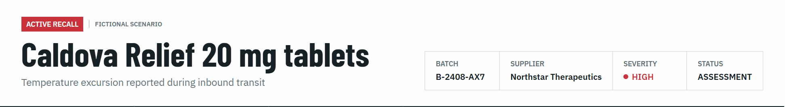
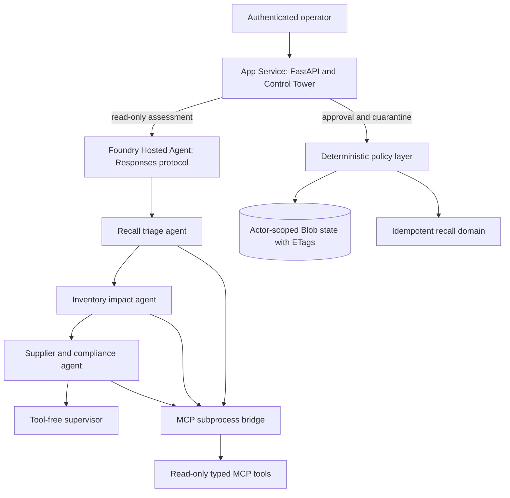
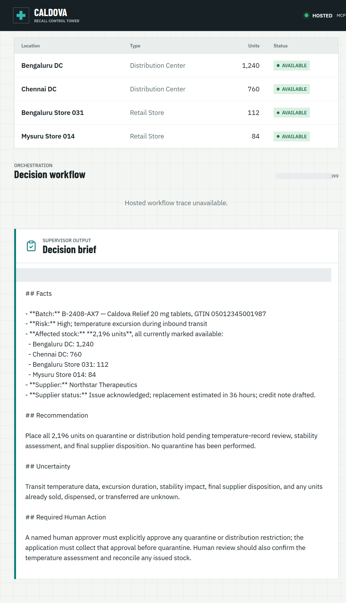

# Engineering Agentic Recall Controls with MCP and Microsoft Foundry

AI agents become operationally interesting when they can reach real systems. They also become operationally dangerous at exactly the same moment.

Caldova Recall Control Tower is a developer demonstration built around that tension. It uses a fictional pharmaceutical recall to show how an agent can gather evidence and prepare a decision while deterministic application code retains authority over approval and inventory mutation. The implementation combines the Model Context Protocol (MCP), Microsoft Agent Framework, a Microsoft Foundry Hosted Agent, FastAPI, Microsoft Entra authentication, managed identity, and optimistic concurrency in Azure Blob Storage.

The central design rule is simple:

> Let the model interpret and recommend. Make ordinary code authenticate, authorize, mutate, and prove what happened.

You can open the [Caldova Recall Control Tower](https://caldova-web-ti3pdz737nyvg.azurewebsites.net/) to see the hosted application. Access requires an authorized Microsoft Entra identity. The [source repository](https://github.com/leestott/mcp-connect) contains the application, infrastructure, tests, evaluation assets, and presentation material; availability depends on the repository's publication status.

> Caldova is fictional, all operational data is synthetic, and this sample is not a production recall system or a source of clinical advice.

## The scenario: useful reasoning, consequential action

The demo starts with a temperature excursion affecting batch `B-2408-AX7` of Caldova Relief 20 mg tablets. The synthetic inventory contains 2,196 units across two distribution centers and two retail stores. A useful system must establish the notice, locate every affected position, check supplier status, explain uncertainty, and recommend an action.

That analysis is a good fit for specialized agents. Quarantining inventory is not.

Quarantine changes operational state. It therefore needs an authenticated human, explicit authorization, a batch-scoped approval, concurrency control, idempotency, and an audit record. None of those guarantees should depend on a prompt being followed.



*The authenticated hosted application at the start of the fictional recall. Captured on September 17, 2026.*

## Architecture: separate reasoning from authority

The solution has two related but deliberately separate paths.



The **reasoning path** invokes a Hosted Agent through the Responses protocol. Four agents run in a fixed sequence: triage, inventory impact, supplier/compliance, and supervisor. The first three have narrow read-only tools. The supervisor has no tools and synthesizes the accumulated context into a decision brief.

The **authority path** remains in the web application. It validates the EasyAuth identity claims, checks an approver allowlist, binds approval to the caller, batch, action, and current demo generation, and only then calls deterministic domain code. State is stored per actor in Blob Storage and updated with ETag match conditions so concurrent writes fail instead of silently overwriting each other.

There is also a deterministic localhost demo. It reuses synthetic domain fixtures and demonstrates MCP contracts, approval, quarantine, and replay without a model or cloud account. It is useful for development, but its typed approver name and in-memory state are not production identity or durable compliance evidence.

## Building a narrow MCP surface

MCP standardizes how an AI application discovers and calls external tools. It does not remove the need to design those tools carefully.

Caldova exposes small, typed operations such as `get_recall_notice`, `locate_inventory`, and `get_supplier_status`. Inputs are constrained with Pydantic, and tool annotations tell clients that these operations are read-only and closed-world:

```python
@mcp.tool(
    title="Locate affected inventory",
    annotations=ToolAnnotations(
        read_only_hint=True,
        open_world_hint=False,
    ),
)
def locate_inventory(batch_id: BatchId) -> dict[str, Any]:
    return STORE.locate_inventory(batch_id)
```

The mutation tool is separately marked destructive and requires a batch-scoped approval token. Those annotations improve discovery and planning, but they are metadata, not an authorization boundary. The real check occurs inside `quarantine_batch`, below the model and below the tool description.

The Hosted Agent does not receive the mutation tools at all. Its specialists call only three read operations through an isolated MCP stdio subprocess. This is stronger than asking an all-powerful agent to "please remain read-only": capability is constrained by construction.

The subprocess boundary also keeps MCP v2 dependencies isolated from the Foundry hosting environment. Each call has a timeout, bounded concurrency, structured JSON handling, and a generic failure response that does not leak subprocess details.

## Fixed workflows beat vague autonomy for this case

Multi-agent does not have to mean dynamic routing. Caldova uses an explicit sequence because the business dependency is explicit: validate the notice before locating inventory, locate inventory before checking supplier implications, and synthesize only after all three specialist outputs exist.

```python
return (
    WorkflowBuilder(start_executor=triage, output_from=[supervisor])
    .add_edge(triage, inventory)
    .add_edge(inventory, compliance)
    .add_edge(compliance, supervisor)
    .build()
    .as_agent()
)
```

This topology is easier to test and reason about than an unconstrained planner. Each specialist has one job and one tool allowlist. Full context is passed where synthesis requires it, while the supervisor remains tool-free.

Request isolation matters too. A hosted process can serve concurrent users, so workflow state must not leak between requests. The sample creates a fresh workflow agent for each request context rather than reusing mutable agent state globally.

## What the live hosted run showed

On September 17, 2026, the hosted application completed a read-only assessment for the synthetic batch. The resulting brief reported:

- 2,196 affected units across four locations.
- A high-risk inbound temperature excursion.
- Supplier acknowledgement, a 36-hour replacement estimate, and a drafted credit note.
- Unknown transit temperature details, excursion duration, stability impact, final supplier disposition, and potentially issued stock.
- A recommendation to hold or quarantine stock, explicitly stating that no quarantine had occurred.
- A required human approval before any inventory restriction.



*The live Hosted Agent decision brief. Transient response and correlation identifiers are masked; the operations rail is excluded because it contains actor-scoped audit data.*

The screenshot also shows an important truthfulness choice: the UI says **Hosted workflow trace unavailable**. The application does not invent stage completion or tool-call evidence when the hosted endpoint does not return trustworthy trace data. The answer can be displayed, but it must not be presented as proof of an internal execution path.

## Approval is a protocol, not a button

The hosted web path uses App Service authentication with Microsoft Entra. The application accepts the injected principal only on the configured App Service host, validates tenant and object identifiers, applies a user allowlist, and performs an additional approver check for mutation requests. State-changing calls also require the expected origin and an application request header.

Approval is then bound to five facts:

1. The authenticated actor.
2. The current demo generation.
3. The affected batch.
4. The `quarantine` action.
5. A ten-minute validity window until first use.

Resetting the demo creates a new generation, invalidating old handles. Consuming an approval does not make replay unsafe: the same bound handle can repeat the same quarantine operation, but domain code changes only positions that are not already quarantined. A second call reports an idempotent replay with zero additional positions changed.

This is the difference between a human-in-the-loop interface and a human-authorized system. A modal dialog provides user experience; identity binding and deterministic policy provide control.

## Durable state needs concurrency semantics

The hosted application stores each actor's synthetic session in a separate Blob object. A load returns both JSON state and its ETag. A save uses `IfNotModified` semantics; if another request updated the same state first, Azure Storage rejects the stale write and the API returns a conflict.

```python
conditions = (
    {"etag": etag, "match_condition": MatchConditions.IfNotModified}
    if etag else {}
)
await blob.upload_blob(
    json.dumps(state),
    overwrite=etag is not None,
    **conditions,
)
```

Without that condition, two browser requests could both read the same approval state and overwrite one another using last-writer-wins behavior. Agent systems do not get a concurrency exemption: ordinary distributed-systems rules still apply.

## Fail closed, and make the failure legible

The analysis adapter accepts only HTTPS Foundry endpoints with the expected path, uses a managed-identity token for `https://ai.azure.com/.default`, disables redirects, and enforces bounded connect and overall timeouts. It accepts only a completed assistant response with non-empty output text.

If the endpoint times out, returns partial output, returns malformed data, or becomes unavailable, the application clears the analysis lease and reports that no inventory changed. It does not substitute a local answer and label it as hosted. Approval remains locked until a new hosted analysis succeeds.

This can feel strict during a demo, but it protects provenance. A degraded fallback is useful only when the UI and audit model can identify it accurately.

## What is proven, and what is not

The sample provides useful evidence for several engineering claims:

- Typed MCP tools reject malformed input.
- Hosted specialists receive read-only capabilities only.
- Approval is checked below the model and bound to identity and session state.
- Quarantine is idempotent in the synthetic domain.
- Blob ETags prevent stale session writes.
- Empty, partial, failed, and timed-out hosted responses fail closed.
- Local tests cover domain, MCP, workflow, API, and repository-hygiene behavior.

It does not prove that the sample is a production recall platform. The scenario is synthetic. The local audit log is not tamper-evident. The hosted UI currently lacks trustworthy per-stage and per-tool trace rendering. Deployment-specific RBAC, EasyAuth configuration, telemetry access, model behavior, load characteristics, costs, and recovery procedures require validation in each environment.

Evaluation evidence also expires. Golden cases and evaluator configuration are useful assets, but historical results are not a current release certificate. Re-run evaluations against the deployed agent version and inspect failures before making quality claims.

## Try the pattern

Start with the deterministic path before provisioning cloud resources:

```powershell
Set-Location (git rev-parse --show-toplevel)
py -3.13 -m venv caldova-recall-control/.venv
./caldova-recall-control/.venv/Scripts/python.exe -m pip install `
  -r caldova-recall-control/requirements-ui.txt
./caldova-recall-control/.venv/Scripts/python.exe -m uvicorn `
  control_tower_api:app `
  --app-dir caldova-recall-control/src `
  --host 127.0.0.1 `
  --port 8091
```

Then inspect the MCP server over stdio:

```powershell
./caldova-recall-control/.venv/Scripts/python.exe `
  caldova-recall-control/scripts/inspect_mcp.py
```

The inspector discovers the real tool schemas, reads the synthetic inventory, rejects malformed input and an unapproved mutation, and confirms the stock remains unchanged. Only after that local contract is understood should you configure a Foundry project, deployment identity, model deployment, and Hosted Agent.

## Engineering takeaways

The most reusable lesson in Caldova is not the number of agents. It is the placement of authority.

- Give each model the smallest useful toolset.
- Prefer explicit workflow topology when the business process is known.
- Treat tool annotations as descriptive metadata, not access control.
- Bind consequential approval to authenticated identity, resource, action, and session generation.
- Put mutation and idempotency in deterministic domain code.
- Use optimistic concurrency for durable web state.
- Preserve provenance by failing closed instead of silently changing execution paths.
- Show only evidence the system actually captured.

Agents are excellent at turning fragmented evidence into an actionable brief. Reliable systems make sure the brief and the action remain two different things.

## References

- [Caldova source repository](https://github.com/leestott/mcp-connect)
- [Model Context Protocol introduction](https://modelcontextprotocol.io/docs/getting-started/intro)
- [Microsoft Agent Framework workflow capabilities](https://learn.microsoft.com/en-us/agent-framework/workflows/)
- [Deploy a Hosted Agent in Microsoft Foundry](https://learn.microsoft.com/en-us/azure/foundry/agents/how-to/deploy-hosted-agent)
- [Configure Microsoft Entra authentication for Azure App Service](https://learn.microsoft.com/en-us/azure/app-service/configure-authentication-provider-aad)
- [Manage concurrency in Azure Blob Storage](https://learn.microsoft.com/en-us/azure/storage/blobs/concurrency-manage)
